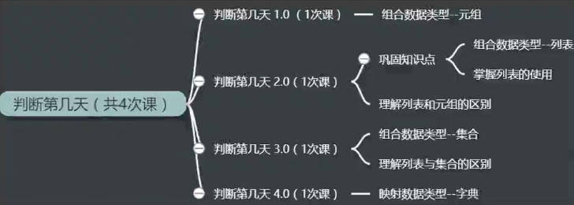

## 判断一个日期是第几天

    作者：杨杰
    功能：判断一个日期是一年中的第几天
    版本：0.4.0
    日期：2018-1-5
    许可证：GPL3+
    0.1.0 新增功能：输入某年某月某日，判断这一天是这一年中的第几天
    0.2.0 更新功能：（1）用列表替换元组（2）模块化
    0.3.0 更新功能：将月份划分为不同的集合再操作
    0.4.0 更新功能：将月份及其对应天数通过字典表示

- [x] [which_day_v0.1.0.py](which_day_v0.1.0.py)
- [x] [which_day_v0.2.0.py](which_day_v0.2.0.py)
- [x] [which_day_v0.3.0.py](which_day_v0.3.0.py)
- [x] [which_day_v0.4.0.py](which_day_v0.4.0.py)

---

### 参考资料

- Python 的 time 库有一个方法可以直接获取“第几天”

<https://docs.python.org/3/library/time.html#time.strftime>

