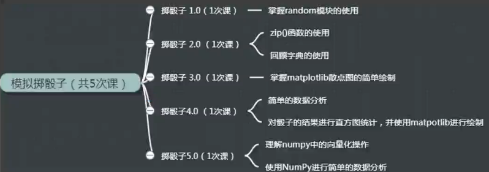

## 模拟掷色子

    作者：杨杰
    功能：模拟掷色子
    版本：0.5.0
    日期：2018-1-5
    许可证：GPL3+
    0.1.0 新增功能：（1）模拟抛掷一个色子，并输出其结果
                    （2）遍历列表时，同时返回索引号和值
    0.2.0 更新功能：模拟抛掷两个色子
    0.3.0 新增功能：可视化抛掷两个色子的结果
    0.4.0 更新功能：对结果进行简单的数据统计和分析
    0.5.0 更新功能：使用科学计算库简化程序，完善数据可视化结果

- [x] [emulate_dice_v0.1.0.py](emulate_dice_v0.1.0.py)
- [x] [emulate_dice_v0.2.0.py](emulate_dice_v0.2.0.py)
- [x] [emulate_dice_v0.3.0.py](emulate_dice_v0.3.0.py)
- [x] [emulate_dice_v0.4.0.py](emulate_dice_v0.4.0.py)
- [x] [emulate_dice_v0.5.0.py](emulate_dice_v0.5.0.py)
