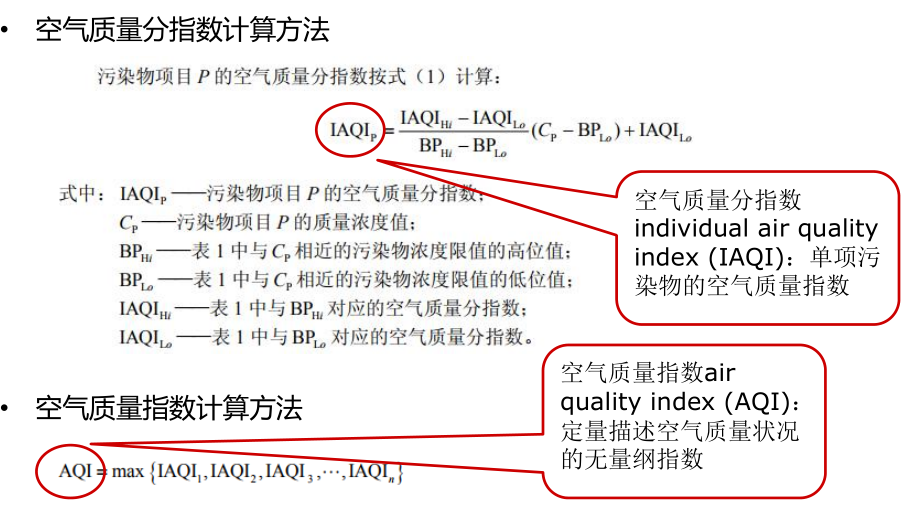
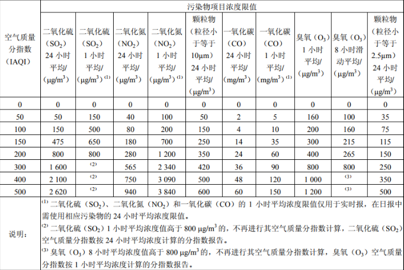

## 空气质量指数计算

    作者：杨杰
    功能：计算空气质量指数
    版本：0.1.0
    日期：2018-1-6
    许可证：GPL3+
    0.1.0 新增功能：计算 AQI (Air Quality Index)

- [x] [aqi_v0.1.0.py](aqi_v0.1.0.py)

---

    作者：杨杰
    功能：对 JSON 文件进行解码
    版本：0.3.0
    日期：2018-1-6
    许可证：GPL3+
    0.1.0 新增功能：（1）读取已经获取的 JSON 数据文件
                    （2）将 AQI 前五的数据输出到文件
    0.2.0 新增功能：将 JSON 文件转换为 CSV 文件
    0.3.0 更新功能：根据输入的文件判断是 JSON 格式还是 CSV 格式，并进行相应的操作

- [x] [json_v0.1.0.py](json_v0.1.0.py)
- [x] [json_v0.2.0.py](json_v0.2.0.py)
- [x] [json_v0.3.0.py](json_v0.3.0.py)

---

    作者：杨杰
    功能：网络爬虫
    版本：0.2.0
    日期：2018-1-6
    许可证：GPL3+
    0.1.0 新增功能：爬取 http://pm25.in/ 的网页，从网页中提取 AQI
    0.2.0 更新功能：用 beautifulsoap4 改写程序

- [x] [web_crawler_v0.1.0.py](web_crawler_v0.1.0.py)
- [x] [web_crawler_v0.2.0.py](web_crawler_v0.2.0.py)

---

### AQI 计算公式

---

### 参考资料

- JSON 格式化

<https://jsonformatter.curiousconcept.com/>

