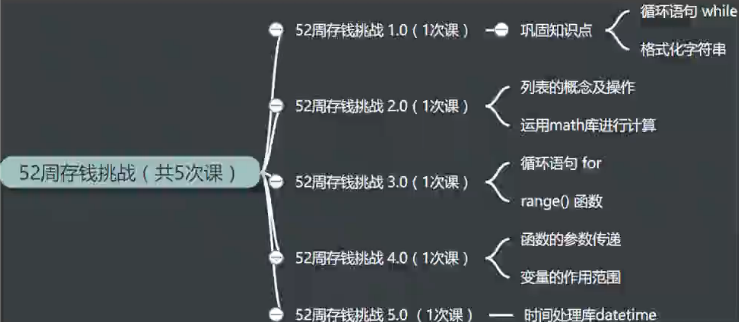

## 52 周存钱挑战

    作者：杨杰
    功能：52 周存钱挑战
    版本：0.5.0
    日期：2018-1-4
    许可证：GPL3+
    0.1.0 新增功能：第一周存 10 元，之后每周递增 10 元，直到第 52 周，共存钱 13780 元
    0.2.0 更新功能：用列表存放每一周存入的钱
    0.3.0 更新功能：用 for 循环替换 while 循环
    0.4.0 更新功能：灵活设置每周的存款数，递增的存款数和存款周数
    0.5.0 新增功能：根据用户输入的日期，来判断是一年中的哪一周，然后输入相应的存款金额

- [x] [money_challenge_v0.1.0.py](money_challenge_v0.1.0.py)
- [x] [money_challenge_v0.2.0.py](money_challenge_v0.2.0.py)
- [x] [money_challenge_v0.3.0.py](money_challenge_v0.3.0.py)
- [x] [money_challenge_v0.4.0.py](money_challenge_v0.4.0.py)
- [x] [money_challenge_v0.5.0.py](money_challenge_v0.5.0.py)

---

### 参考资料

<https://docs.python.org/3/library/datetime.html#strftime-strptime-behavior>
