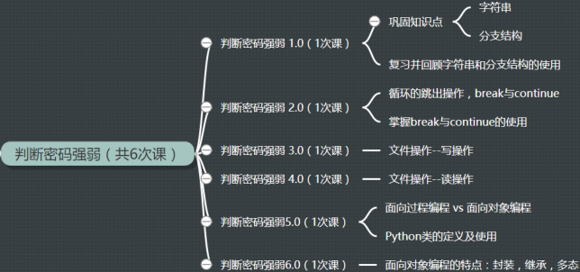

## 判断密码强弱

    作者：杨杰
    功能：判断密码强弱
    版本：0.5.0
    日期：2018-1-5
    许可证：GPL3+
    0.1.0 新增功能：设置一个变量 strength_level 用于几率密码的强弱，初始为 0，每满足一个条件，加 1
                    长度判断，使用 len() 方法
                    包含数字判断，使用 isnumeric() 方法
                    包含字母判断，使用 isalpha() 方法
                    如果 strength_level 等于3，密码强度合格，否则不合格
    0.2.0 新增功能：（1）限制密码设置次数；
                    （2）循环的终止
    0.3.0 新增功能：保存设置的密码及其对应的密码强度到文件中
    0.4.0 新增功能：将相关方法封装成一个整体：面向对象编程
                    定义一个 password 工具类
    0.5.0 新增功能：定义一个文件操作工具类

- [x] [pwd_strength_v0.1.0.py](pwd_strength_v0.1.0.py)
- [x] [pwd_strength_v0.2.0.py](pwd_strength_v0.2.0.py)
- [x] [pwd_strength_v0.3.0.py](pwd_strength_v0.3.0.py)
- [x] [pwd_strength_v0.4.0.py](pwd_strength_v0.4.0.py)
- [x] [pwd_strength_v0.5.0.py](pwd_strength_v0.5.0.py)

---

    作者：杨杰
    功能：读取文件中的密码
    版本：0.2.0
    日期：2018-1-5
    许可证：GPL3+
    0.1.0 新增功能：一次性读取文件中的密码
    0.2.0 更新功能：逐行读取文件中的密码

- [x] [pwd_read_v0.1.0.py](pwd_read_v0.1.0.py)
- [x] [pwd_read_v0.2.0.py](pwd_read_v0.2.0.py)

---

### 介绍

- 密码强度

  是指一个密码对抗猜测或者暴力破解的有效程度；一般是指一个未授权的访问者得到正确密码的平均访问次数

- 强密码可以降低安全漏洞的整体风险
- 简易版（常用）规则
  1. 密码长度至少 8 位
  2. 密码含有数字
  3. 密码含有字母

---

### 参考资料

- 更多 isxxx() 方法可以参考以下文档

<https://docs.python.org/3/library/stdtypes.html#string-methods>
